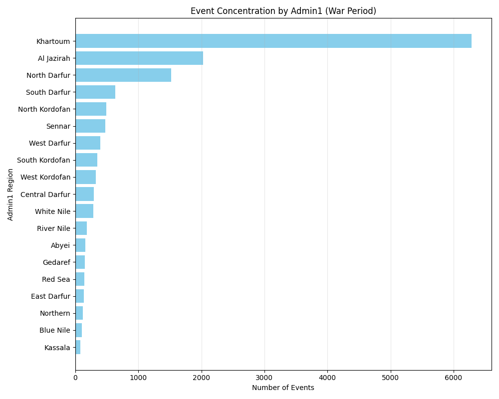
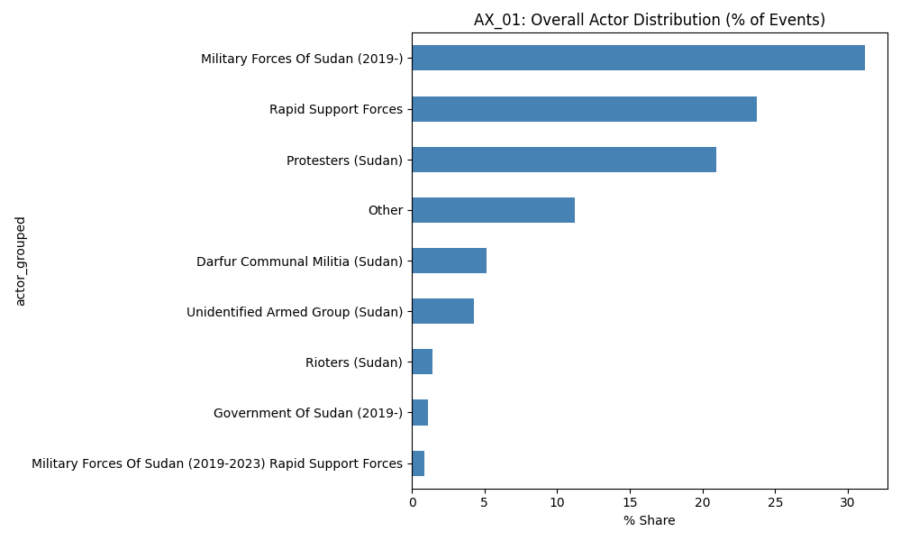
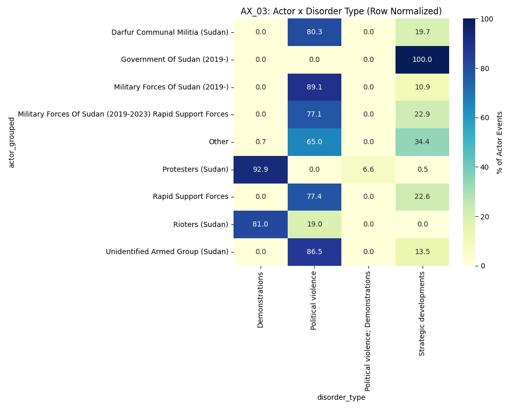
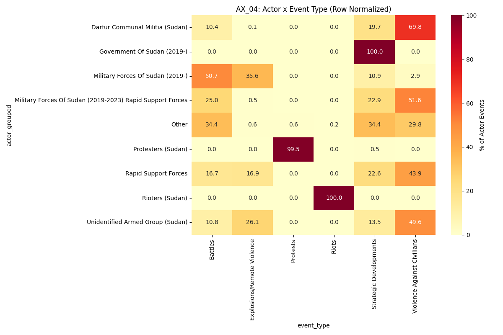
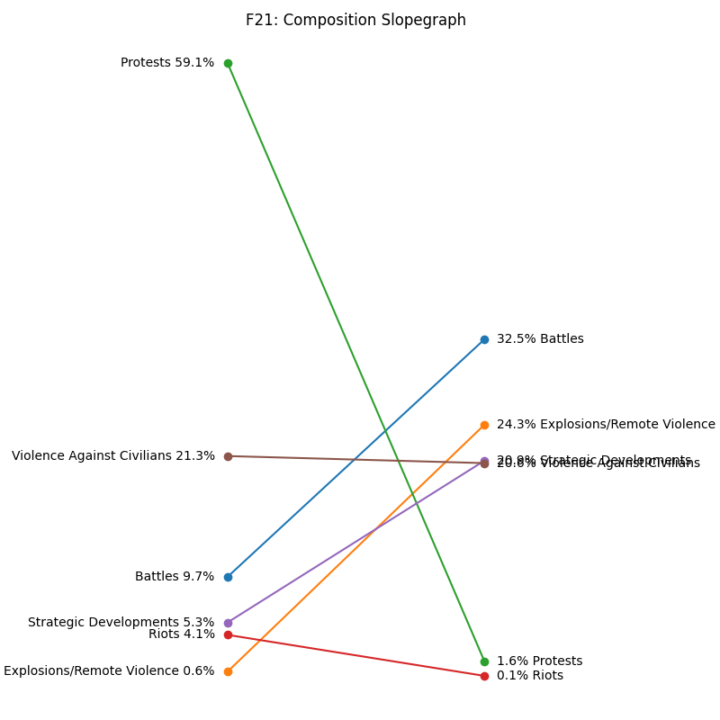
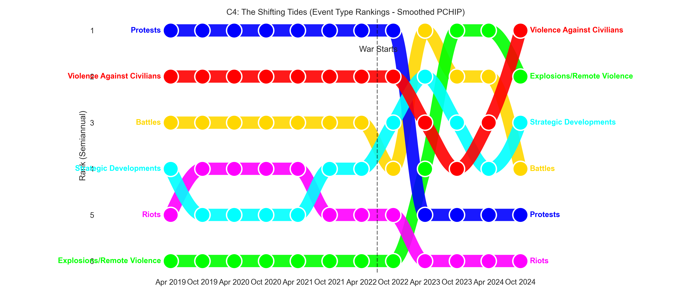

# The Cutting Room Floor: Editorial & Analytical Choices

> "These figures didn't choose themselves. Every chart you saw was picked from a pile of discarded experiments."

This document tracks the messy reality behind the final report. It details the hypotheses we tested, the visualizations we built, and the specific reasons we killed them—even the ones that looked good.

For the raw code that generated these experiments, see the `scrapCodes/` directory (kept locally but not shipped to prod). Each subsection below notes the scripts we leaned on, so the path from hypothesis → code → figure stays auditable.

---

## 1. The Original Plan: "The War Week"

**Hypothesis**: We initially planned a three-part structure:
1. Pre-war (The baseline)
2. **The War Week (April 15-22)**: A microscopic look at the 7 days that broke the country.
3. Post-war (The new reality)

**Supporting explorations**: rapid aggregation notebooks in `scrapCodes/temporal_aggregation.py` and `scrapCodes/event_timelapse.py` produced small-multiple week slices (not retained here because the counts were too low to be reliable).

**Why we killed it**:
- **Small N Problem**: When we zoomed into just 7 days, the event count was statistically too low to support robust generalizations.
- **Reporting Lag**: Analyzing the data showed that the "fog of war" in that first week meant many events were back-filled later or reported with lower precision.
- **Conclusion**: A "micro-history" required granular qualitative data (interviews, ground reports) that purely event-based data couldn't sustain without creating misleading certainty.

---

## 2. Geography: The Density Trap

**What we tried**: We wanted to show the hardest-hit regions immediately. We generated `F4_admin1_event_concentration.png` to rank states by total violence.

**Why we killed it**:
- **False Precision**: Admin1 (State) boundaries are arbitrary in a fluid conflict. Ranking states implied that the *entire* state was dangerous, whereas violence was often hyper-localized to specific cities or roads.
- **The Solution**: We switched to the **Choropleth Map (Figure 6)** in the final report. It uses time-decay and specific event locations to show *where* violence lives, rather than just tallying it up on a leaderboard.

---

## 3. The Sexual Violence Narrative

**What we explored**: A dedicated section analyzing trends in violence against women.

**Why we dropped it**:
- **Data Quality**: Sexual violence is systematically under-reported in conflict event data. Analysis of the raw logs showed too many gaps and inconsistent attributes.
- **Ethical Risk**: Presenting a chart based on incomplete data risks minimizing the phenomenon. If the data captures 5% of incidents, a "flat line" looks like stability when it's actually a reporting failure.
- **Decision**: Better to speak to it in the text or rely on specialized qualitative reports (referenced in the intro) than to present a potentially misleading quantitative chart.

---

## 4. Defining "The Actors" (or: Who is fighting?)

**The Problem**: The raw data is a mess of naming conventions. We had "Military Forces of Sudan," "SAF," "Government of Sudan," "RSF," "Janjaweed," "Militias," etc.

**Attempt 1: The Raw Distribution**
We visualized the raw actor counts (`AX_01_actor_overall_distribution.png`).

**Critique**: It's a "hairball." The long tail of small militias obscures the main structural conflict.
**The Fix**: We implemented a rigorous **Actor Normalization** pipeline in the code, bucketing these dozens of names into: `SAF`, `RSF`, `Protest Groups`, and `Other Armed Groups`.

**Attempt 2: Behavioral Heatmaps**
Once normalized, we tried to find their "fingerprints" using heatmaps.
- **By Disorder Type** (`AX_03`):

- **By Event Type** (`AX_04`):

**The Insight**: These heatmaps confirmed our hypothesis—SAF and RSF behave differently. SAF correlates with "Explosions/Remote Violence" (Battles), while RSF correlates strongly with "Violence against civilians."
**The Result**: This analysis justified the **"Behavioral DNA" Diverging Bar Chart (AX_04)** in the final report, which is much cleaner than these heatmaps but rests on their findings.

---

## 5. Visualizing Composition Change

**What we tried**: To show the shift from "Protest" to "War," we built a **Slopegraph** (`F21_composition_slopegraph.png`).

**Why we killed it**:
- **Too abstract**: Slopegraphs are great for analysts but require too much cognitive load for a general audience.
- **Hidden Volume**: It shows the *rank* change but hides the massive *volume* change.
- **The Solution**: We used **Stacked Density Plots (Figure 2)**. They show the *collapse* of protest volume and the *surge* of battle volume simultaneously, which is the emotional and structural truth of the story.

---

## 6. The Hidden Precision

One thing not shown in the charts but meticulous in the code: **Geo-Precision filtering**.
- We didn't just map every point.
- In the data cleaning pipeline, we filtered based on ACLED's `geo_precision` code.
- Events with low precision (regional level only) were treated differently than town-level precision to prevent "dot scattering" in empty deserts.
- This doesn't show up as a "figure," but it's the reason the map doesn't look like a uniform spray of noise.

---

## 7. Breadcrumbs to the Workbench

- **Code paths**: Explorations live in `scrapCodes/` (e.g., `exploratory_visuals.py`, `event_timelapse_decay.py`, `admin1_mapping.py`, `sexual_violence.py`). These are kept local to avoid shipping unfinished ideas.
- **Artifacts**: All exploratory images referenced here are now gathered in `docs/supporting_images/` for a single place to review discarded options without touching the live report.
- **Data boundaries**: All decisions above were made on the ACLED-derived dataset with events ranging from 2019-04-15 to 2025-01-23. Anything beyond that date would require a rerun of the pipeline and a refresh of this choices log.

---

## 8. The Eclipse Bubbles That Didn't Land

**What it was**: `C4_eclipse_bubbles.png` — a circular/bubble concept that tried to dramatize simultaneous collapses and surges.

**Why we loved it**:
- Visually striking; the idea was to show overlapping pressures in a single, cinematic frame.

**Why it didn't ship**:
- **Fit**: It drew focus to the aesthetic rather than the argument; readers got lost in the form before reaching the takeaway.
- **Comparability**: Bubble sizing made it hard to compare categories over time without a legend lecture.
- **Narrative friction**: Every time we slotted it in, it interrupted pacing instead of propelling it.

**Decision**: Parked. Kept here as a reminder that visual novelty can still lose to clarity.

---

*This document serves as the audit trail for the "Choice" to prioritize narrative clarity over data volume.*
